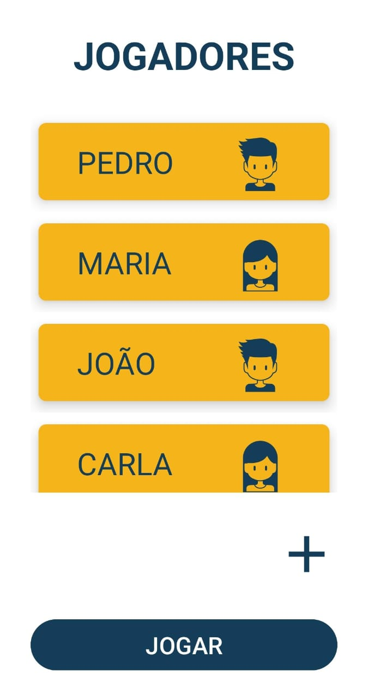
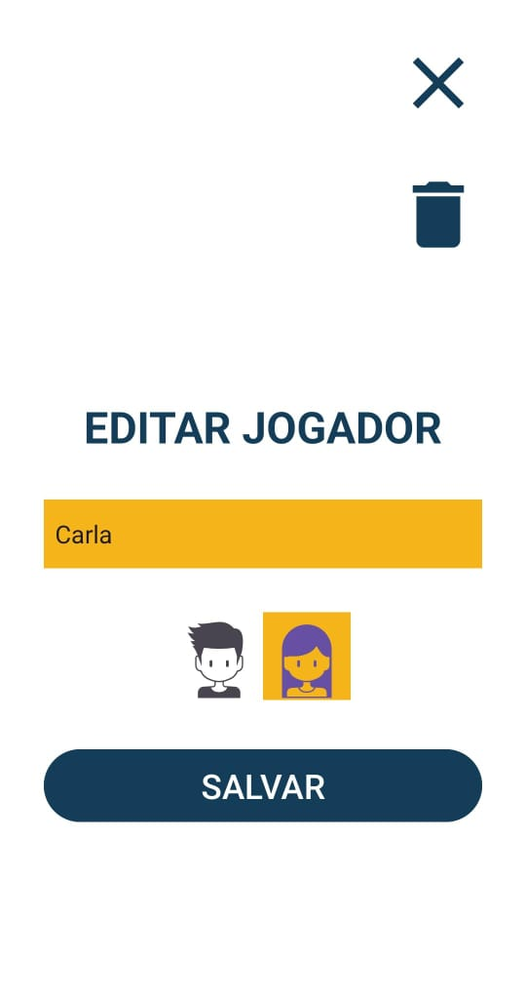
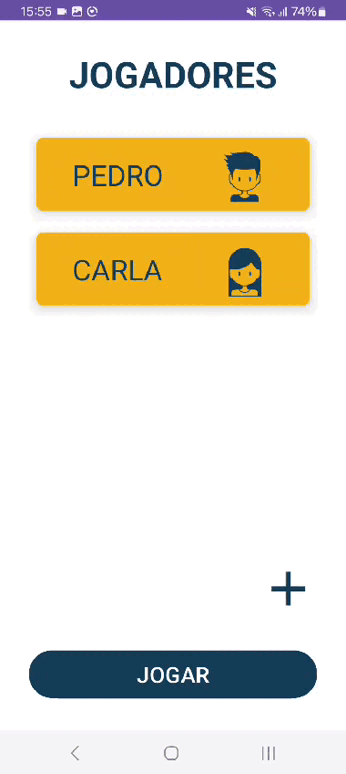

<h1 align="center">Verdade ou Desafio</h1>

  
   
  
  
  

  

⭐ Esse é um projeto para demonstrar meu conhecimento técnico no desenvolvimento Android nativo com Kotlin. Mais informações técnicas abaixo.

Aplicativo do jogo verdade ou desafio. No aplicativo podemos adicionar, alterar e deletar jogadores. O jogo conta com perguntas e desafios diferentes dependendo do modo de jogo escolhido e do sexo do jogador, tendo restrição da quantidade de vezes que pode ser escolhido verdade ou desafio para que o jogador não fique apenas em um tipo de escolha.

 

<!--## Download
BADGE DA PLAYSTORE https://play.google.com/intl/en_us/badges/

Ou -->
Faça o download da <a href="apk/app-debug.apk?raw=true">APK diretamente</a>. Você pode ver <a href="https://www.google.com/search?q=como+instalar+um+apk+no+android">aqui</a> como instalar uma APK no seu aparelho android.

## Tecnologias usadas e bibliotecas de código aberto

- Minimum SDK level: 22+
- [Linguagem Kotlin](https://kotlinlang.org/)

- Jetpack
  - Lifecycle: Observe os ciclos de vida do Android e manipule os estados da interface do usuário após as alterações do ciclo de vida.
  - ViewModel: Gerencia o detentor de dados relacionados à interface do usuário e o ciclo de vida. Permite que os dados sobrevivam a alterações de configuração, como rotações de tela.
  - ViewBinding: Liga os componentes do XML no Kotlin através de uma classe que garante segurança de tipo e outras vantagens.
  - Room: Biblioteca de abstração do banco de dados SQLite que garante segurança em tempo de compilação e facilidade de uso.

- Arquitetura
  - MVVM (View - ViewModel - Model)
  - Comunicação da ViewModel com a View através de LiveData
  - Repositories para abstração da comunidação com a camada de dados.
  
- Bibliotecas
  - [Room database](https://github.com/square/retrofit): Biblioteca de abstração do banco de dados SQLite que garante segurança em tempo de compilação e facilidade de uso.
  
## Arquitetura
O jogo Verdade ou desafio utiliza a arquitetura MVVM e o padrão de Repositories, que segue as [recomendações oficiais do Google](https://developer.android.com/topic/architecture).
  

## Features

### Adicionando jogadores

Adicionando, alterando e deletando jogadores e atualizando dinamicamente o recyclerview com a lista de jogadores.

### Modo e escolha

Escolhendo o modo de jogo, que terão uma lista de verdades e desafios diferentes, e a escolha entre verdade ou desafio restringindo entre 3 verdades para cada 1 desafio por cada jogador.

